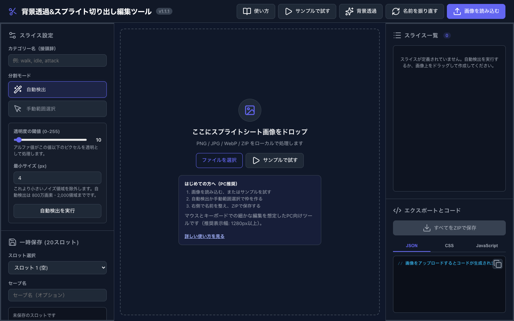
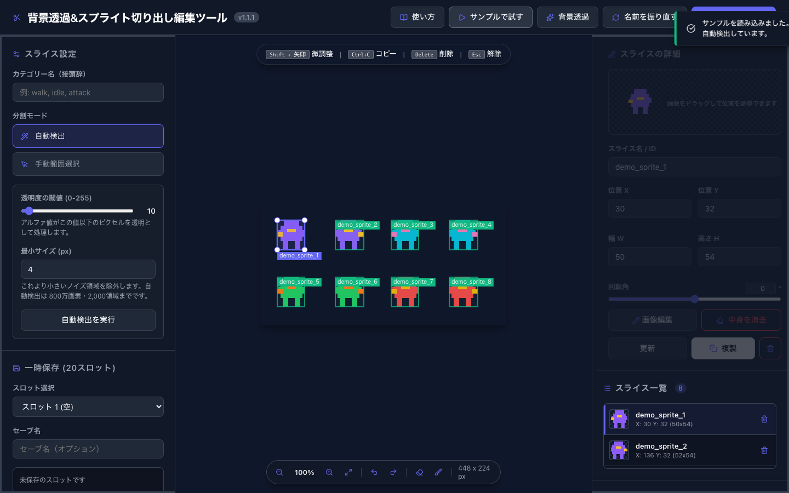
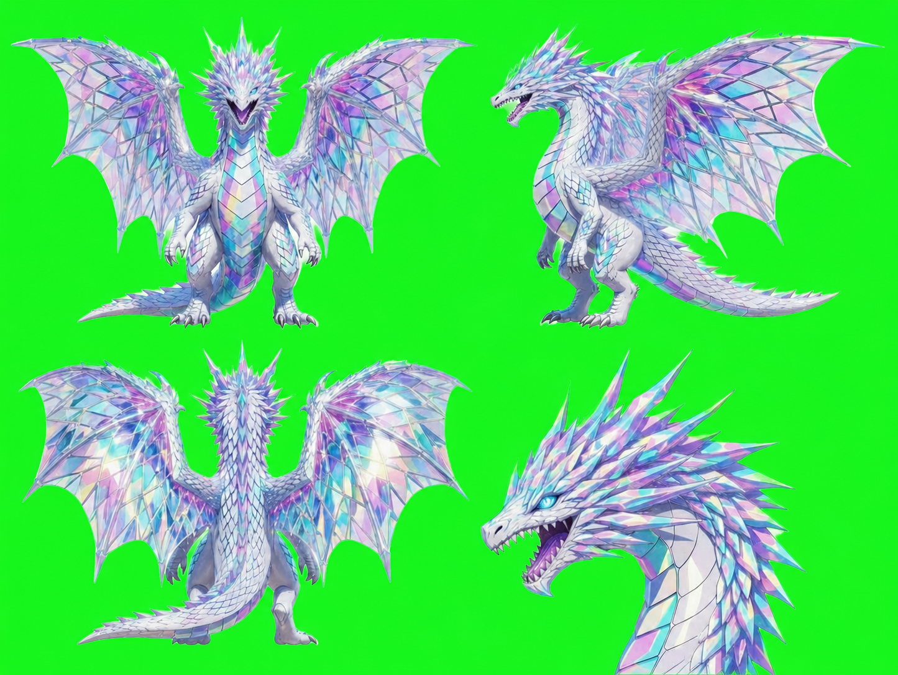

# 背景透過＆スプライト切り出し編集ツール

スプライトシートをブラウザだけで切り出し、個別PNG・JSON・CSSをまとめたZIPとして保存できる、PC向けの静的Webアプリです。







## はじめて使う場合

1. アプリを開き、**「サンプルで試す」**（透過済みの8スプライト）または **「サンプル2：背景透過」**（緑背景のドラゴン）を押します。
2. サンプル1はすぐに自動検出されます。サンプル2は緑色を設定済みの背景透過画面を開くので、プレビューを確認して **「透過を適用する」** を押すと、自動検出まで続けて試せます。必要なら枠をクリックして名前・座標・サイズを調整します。
3. 右下の **「すべてをZIPで保存」** を押します。編集済みシート、個別PNG、`sprites.json`、`sprites.css` が1つのZIPに出力されます。

実際の画像では、PNG / JPG / WebP / GIF またはこのアプリが出力したZIPを読み込めます。透明背景の画像なら自動検出、配置が不規則なら「手動範囲選択」を使います。安全性のためSVGは受け付けません。

## 主な機能

- 透明領域を基準にしたスプライトの自動検出
- 手動範囲選択、座標・サイズ・名前・回転の編集
- 背景透過、消しゴム、復元ブラシ、Undo / Redo
- 一時保存20スロット（ブラウザのIndexedDB。使えない環境では当該タブ内のメモリ保存）
- ZIPの再読み込みによる作業復元
- JSON / CSS / JavaScriptコードの生成とコピー

## 利用環境と上限

- PC向けです。マウスとキーボードでの操作を前提とし、横幅1280px以上を推奨します。
- 入力画像は50MBかつ1,600万画素までです。
- 自動検出と背景透過は800万画素まで、検出できるスライスは2,000個までです。
- ZIP書き出しは、切り出す画像の合計が1,600万画素までです。高解像度・大量のスライスは作業を分けて保存してください。
- ZIP読み込みは、圧縮後50MB・5,000ファイル・展開後合計128MBまでです。`sprites.json` は2MB、各エントリは52MBまでに制限しています。
- ZIPのフレーム名は安全な英数字・`_`・`-`に正規化されます。出力先のパスを変更する文字列は利用できません。

## プライバシー

画像の解析、編集、ZIP生成、一時保存はすべてブラウザ内で行います。アプリには外部APIや解析通信はありません。一時保存は同じブラウザの保存領域に限られ、別の端末やブラウザには同期されません。

一時保存には画像そのものが含まれ、ブラウザを閉じても残る場合があります。共有PCでは使わないか、作業後にアプリ内の **「すべての一時保存を削除」** を実行してください。機微な画像を扱う場合は、専用のブラウザプロフィールや専用ドメインでの利用を推奨します。

## セキュリティ

- CSPにより、外部通信・外部スクリプト・埋め込みオブジェクトを禁止しています。
- SVGは受け付けず、ZIPのパス・展開後サイズ・フレーム座標・出力名を検証します。
- 同梱ライブラリはローカル配信です。バージョンとハッシュは [THIRD_PARTY_NOTICES.md](THIRD_PARTY_NOTICES.md) に記録しています。
- 脆弱性の報告方法は [SECURITY.md](SECURITY.md) を参照してください。

## ローカルで確認する場合

```sh
python3 -m http.server 8000
```

実行後に `http://localhost:8000/` を開きます。

## 公開前の確認

- 自分に公開権限のある画像だけを、リポジトリへ追加してください。
- `.env`、Cookie、セッション情報、個人画像、テスト出力ZIPは追加しないでください。
- GitHubでSecret Scanning / Push Protectionを有効にし、公開前に変更内容を確認してください。

## ライセンス

アプリ本体およびLunanecoが権利を持つ同梱素材は、[Lunaneco 表示・非商用ライセンス 1.0](LICENSE) です。

- 非商用目的に限り、利用・改変・再配布を許可します。
- 改変版・再配布版には、**「原著作物の著作権は Lunaneco に帰属します（Original work © 2026 Lunaneco）。」** と明記し、[NOTICE](NOTICE) と `LICENSE` を残してください。
- 改変した場合は、改変者・変更内容の概要・改変日または版番号を表示してください。
- 商用利用、販売、収益化サービスへの組込み、業務利用には、Lunanecoからの事前の書面による許諾が必要です。
- 第三者コンポーネントは、それぞれのライセンスに従います。詳細は [THIRD_PARTY_NOTICES.md](THIRD_PARTY_NOTICES.md) を参照してください。
